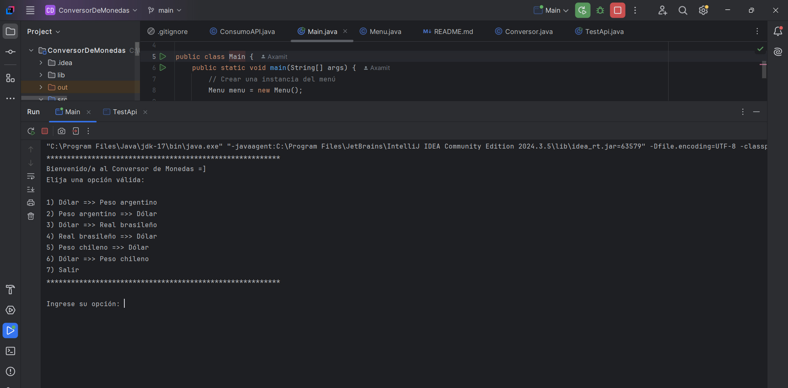
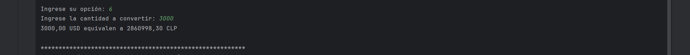

# Conversor de monedas

Conversor de monedas es una aplicación de consola en Java que permite convertir entre distintas monedas usando la API de ExchangeRate.  
El programa obtiene las tasas de cambio en tiempo real y permite al usuario interactuar mediante un menú sencillo.

---
## 💻 Tecnologías

- Java 17
- Gson para manejar JSON
- API ExchangeRate para tasas de cambio
- IntelliJ IDEA (IDE recomendado)
---
## 🚀 Funcionalidades

- Conversión de:
    - Dólar ↔ Peso argentino
    - Dólar ↔ Real brasileño
    - Dólar ↔ Peso chileno
- Menú interactivo de consola
- Manejo de errores en la entrada de usuario
- Obtención de tasas de cambio en tiempo real desde la API
---
## 📸 Vista del menú en consola

Así se muestra el menú principal al usuario:



### Ejemplo de conversión
Aquí un ejemplo donde el usuario selecciona una opción y realiza la conversión:



---
## 📦 Estructura del proyecto

- `app.Main`: Clase principal con el método `main` que inicia la aplicación.
- `ui.Menu`: Clase que muestra el menú y gestiona la interacción con el usuario.
- `service.Conversor`: Clase que realiza los cálculos de conversión.
- `service.ConsumoAPI`: Clase que se comunica con la API de ExchangeRate para obtener las tasas de cambio.
---
## 🔑 Configuración de la API Key

Se recomienda no exponer la API Key directamente en el código. Puedes usar:

- Variable de entorno `API_KEY_EXCHANGE`
- Archivo `application.properties` o `config.properties` (opcional)

Ejemplo de variable de entorno en IntelliJ:

1. Run → Edit Configurations
2. Selecciona tu clase `Main`
3. En **Environment variables** agrega:  API_KEY_EXCHANGE=TU_API_KEY_AQUI
---
## 🎯 Uso

1. Clonar el repositorio:
```bash
git clone https://github.com/axamitta/ConversorDeMonedas.git
